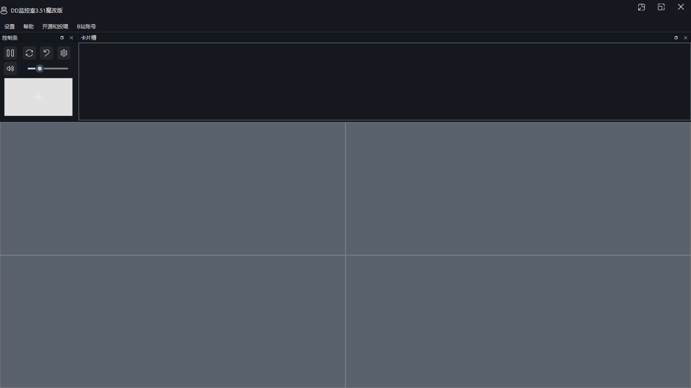
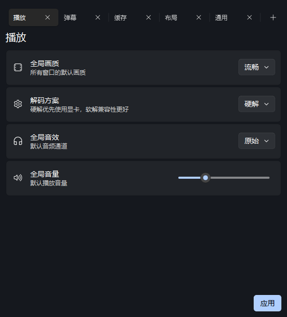
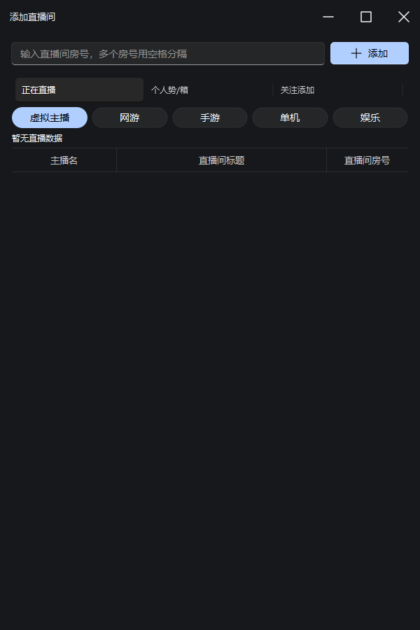

# DD Monitor

> B 站多窗口直播监控工具 · 基于 PySide6 + MPV + 自研 OpenGL 弹幕引擎
> 支持 16 个嵌入式 + 16 个悬浮窗同时观看，实时弹幕、自适应画质、CDN 切换、开播提醒、录制

---

## 目录

- [关于本项目](#关于本项目)
- [核心特性](#核心特性)
- [截图](#截图)
- [架构概览](#架构概览)
- [快速上手](#快速上手)
- [配置指引](#配置指引)
- [使用指南](#使用指南)
- [核心模块与 API](#核心模块与-api)
- [打包发布](#打包发布)
- [常见问题](#常见问题)
- [贡献指南](#贡献指南)
- [致谢与许可证](#致谢与许可证)

---

## 关于本项目

DD Monitor 最初由 [神君Channel](https://space.bilibili.com/637783) 开发，本仓库是魔改分支，由 [BaoZi_Fly](https://space.bilibili.com/34094740) 维护。在保留原作者全部功能的基础上，进行了底层架构重构、弹幕系统重写、配置管理改良和大量 bug 修复。

- **原项目**：[zhimingshenjun/DD_Monitor](https://github.com/zhimingshenjun/DD_Monitor)
- **当前版本**：**v3.52 魔改版**（基于 MPV + OpenGL 的弹幕渲染方案，告别 VLC 依赖）
- **目标用户**：B站"多开党"、主播比较、VUP 观测站运营、直播监管

---

## 核心特性

### 直播播放
- **32 窗口并行**：16 个嵌入式主窗口 + 16 个独立悬浮窗
- **MPV 内核**：硬件解码支持，CPU 与 GPU 占用远低于 VLC 方案（无需携带 200+ DLL）
- **五档画质**：原画 / 蓝光 / 超清 / 流畅 / 仅音频；可全窗口统一或单窗口独立切换
- **音量增强 0.5x - 4.0x**：单窗口独立调节，倍率持久化（重启保留）
- **CDN 优选**：自动记忆上次稳定 CDN、实时手动切换备用节点
- **全屏 + 窗口交换**：拖拽边框直接交换两个窗口的位置（同时交换音量和弹幕设置）
- **悬浮窗位置记忆**：关闭时保存几何，重新打开恢复到上次位置（分辨率变化自动回退）

### 弹幕系统
- **OpenGL 叠加渲染**：直接在 MPV 帧上用 QPainter 绘制，无 ASS 文件 I/O、无字幕闪烁
- **精灵 LRU 缓存**（最多 128 条/窗口）：相同文字+样式只渲染一次
- **轨道布局引擎**：滚动 / 顶部 / 底部三轨独立管理
- **三种模式一键切换**：全开 / 仅弹幕机 / 全关
- **同传过滤、礼物/进入信息筛选**：空格分隔关键词，灵活控制弹幕窗内容

### 账号与互动
- **扫码登录**：qrcode 库本地生成二维码，Session 持久化到配置，启动自动验证
- **凭据自动刷新**：后台每 6 小时检查 + 主动刷新（避免登录态过期掉线）
- **开播提醒**：浮窗 10s 自动关闭，鼠标点击取消倒计时
- **录制直播流**：手动录制 / 开播自动录制（断流 180s 自动中止并提示）

### 卡片面板
- **热门分区**：虚拟主播 / 网游 / 手游 / 单机 / 娱乐
- **关注列表**：登录后自动拉取最近 500 名关注，按直播状态排序
- **VTB 名册**：内置 8 万行名单 + 在线更新（从 GitHub 仓库拉取 `resources/vtb.csv`）
- **短号解析**：输入短号自动解析为真实房间号
- **置顶**：把常看主播置顶；录制开关单房间独立

### 工程化
- **配置去抖动保存**：连续调整音量不会触发磁盘 IO（500ms 节流）
- **3 份备份轮转**：主配置损坏时自动从备份恢复（`os.rename` 原子操作）
- **配置格式迁移**：v1.x - v3.x 的所有格式自动升级
- **导入/导出预设**：JSON 格式备份当前布局、播放器、音量、关注列表
- **Dock 状态持久化**：窗口布局和 Dock 位置自动保存
- **优雅退出**：退出时停止全部播放/弹幕/取流线程并保存配置，随后硬终止进程，
  根治 `Windows fatal exception: 0xe24c4a02` 类退出崩溃

---

## 截图

**主窗口（顶部 Fluent 导航 + 直播监控页，4 宫格默认布局）：**



**统一设置面板：** 5 个标签页（播放 / 弹幕 / 缓存 / 布局 / 通用），点「应用」后**立即生效**（音量、弹幕、滚动弹幕同步到所有窗口，无需重启）



**添加直播间面板（多 tab：热门 / VTB / 关注）：**



## 界面结构

主窗口为标准 Fluent 布局：顶部 `TopNavigationInterface` 横向导航（图标 + 文字，悬停/选中动画，主题自适应）+ 下方 `StackedWidget` 内容区：

| 分区 | 内容 |
|---|---|
| 直播监控 | 16 宫格 + 左侧控制条（CommandBar：播放/刷新/停止/弹幕设置/静音 + 音量滑条 + 添加主播） |
| 弹幕机 | 毛玻璃弹幕机控制台（打开全部/全局弹幕设置） |
| 卡片面板 | 关注卡片流（CardWidget 悬停动画 + InfoBadge 状态角标） |
| 设置 | 常用设置（画质/解码/音量/主题）+ 完整设置面板入口 |

导航右侧：账号 / 帮助 / 投喂（弹出菜单）。启动默认进入直播监控页。

> 截图由 `scripts/make_screenshots.py` 渲染真实 UI 生成（隔离临时配置，不触碰
> 用户数据）。发版后如需更新截图，直接重跑该脚本即可。

---

## 架构概览

### 目录结构

```
DD监控室.py                # 程序入口（faulthandler / 日志 / 闪屏 / 启动主窗口）
app/                        # 业务代码（按职责分层，包内绝对导入）
├── core/                   # 基础设施：常量、配置、网络、日志、凭据
│   ├── constants.py            # 全局常量（窗口数、弹幕比例等）
│   ├── config_manager.py       # 配置加载/迁移/去抖动保存/备份轮转
│   ├── http_utils.py           # 共享 requests.Session + 指数退避
│   ├── bili_credential.py      # B站凭据规范化
│   ├── app_version.py          # 版本号（发版唯一修改入口）
│   ├── log.py                  # 全局日志
│   └── exception_handlers.py   # 未捕获异常/线程异常兜底
├── danmaku/                # 自研 OpenGL 弹幕引擎（无 Qt 依赖的纯逻辑可单测）
│   ├── renderer.py             # 精灵缓存 + 轨道分配 + 绘制
│   ├── layout.py               # 滚动/顶部/底部三轨布局
│   └── settings.py             # 弹幕配置数据模型
├── media/                  # 播放与弹幕接收
│   ├── mpv_gl_widget.py        # MPV render API + QOpenGLWidget（含退出保护）
│   └── remote.py               # 弹幕 WebSocket 接收线程（基于 blivedm）
└── ui/                     # 窗口与控件
    ├── main_window.py          # 主窗口 + 全局控制
    ├── video_widget.py         # 播放窗口（MPV 生命周期/取流/画质/CDN）
    ├── liver_select.py         # 卡片面板 + 关注列表 + VTB 名册
    ├── settings_dialog.py      # 统一设置
    ├── login.py                # 扫码登录
    ├── danmu.py                # 弹幕机 / 全局弹幕设置
    ├── layout_panel.py         # 布局方案面板
    ├── check_update.py         # 版本更新检查
    ├── pay.py                  # 打赏感谢
    ├── common_widget.py        # 通用组件（Slider、图片下载线程）
    └── uikit_bridge.py         # Fluent 主题桥（令牌表/取色/QSS）
resources/                 # 运行时资源：splash.jpg、vtb.csv、entitlements.plist
                           #   + config.json 及 3 份轮转备份（运行时生成，不入库）
blivedm/                   # vendored 弹幕协议库（上游不发布 PyPI）
qfluentwidgets_pro/        # vendored Fluent 组件库（PySide6-Fluent-Widgets-Pro）
docs/                      # 截图、发版说明、多平台方案、文档规范
scripts/                   # 构建脚本、运行脚本、截图生成器
tests/                     # pytest 测试（无头 GUI 环境）
```

### 模块分层与线程模型

```
┌────────────────────────────────────────────────────────┐
│  UI 层（app.ui，主线程）                                 │
│  ├─ MainWindow     主窗口 + 全局控制（main_window.py）    │
│  ├─ VideoWidget    播放窗口（video_widget.py）           │
│  ├─ LiverPanel     卡片面板 + 关注列表（liver_select.py） │
│  ├─ LoginDialog    扫码登录（login.py）                 │
│  ├─ SettingsDialog 统一设置（settings_dialog.py）        │
│  └─ DanmakuUIs     弹幕机/全局弹幕设置（danmu.py）       │
├────────────────────────────────────────────────────────┤
│  渲染层                                                 │
│  ├─ MpvGLWidget    MPV render API + QOpenGLWidget       │
│  ├─ DanmakuRenderer 滚动弹幕引擎（app.danmaku.renderer） │
│  └─ DanmakuLayout   轨道布局（app.danmaku.layout）       │
├────────────────────────────────────────────────────────┤
│  IO 层（线程，只通过 Qt Signal 回传）                     │
│  ├─ GetStreamURL   直播流地址获取（B站 API）             │
│  ├─ FetchRoomInfo  房间信息（标题/主播/状态）             │
│  ├─ remoteThread   弹幕 WebSocket 接收（基于 blivedm）   │
│  ├─ CollectLiverInfo 批量房间状态轮询（60s）            │
│  ├─ RecordThread   直播流录制                           │
│  ├─ CredentialRefreshWorker 凭据自动刷新（6h）         │
│  └─ checkUpdate    版本更新检查（GitHub API）           │
├────────────────────────────────────────────────────────┤
│  基础设施（app.core）                                    │
│  ├─ ConfigManager  统一配置（去抖动/轮转/迁移）           │
│  ├─ http_utils     共享 HTTP 会话 + 指数退避             │
│  └─ bili_credential B站凭据规范化                        │
└────────────────────────────────────────────────────────┘
```

### 关键设计决策

| 决策 | 理由 |
|---|---|
| MPV + OpenGL 替代 VLC | VLC 实例管理开销大、依赖 200+ DLL、字幕闪烁；MPV 单 DLL、GPU 直渲 |
| 自研 OpenGL 弹幕引擎 | MPV 内置 ASS 字幕依赖 libass 跨平台不一致；自研可完全控制渲染细节 |
| blivedm vendored | 上游 xfgryujk/blivedm 不发布 PyPI（README 明确说明）；vendored 保证版本可控 |
| 配置去抖动保存 | 用户连续调整音量/画质时避免磁盘 IO 风暴 |
| QThread + Qt Signal | 后台线程不直接操作 UI；通过 emit 跨线程通信 |
| 单播放器单弹幕线程 | 16+16 窗口需 32 个弹幕线程；独立隔离避免相互影响 |
| MPV 退出时序 | 播放中销毁 libmpv 有已知死锁/崩溃，退出改为跳过销毁 + 硬终止进程 |

---

## 快速上手

### 环境要求

| 组件 | 要求 |
|---|---|
| Python | 3.9 或更高版本（开发目标 3.11） |
| libmpv | MPV 播放器库（Windows 用户需手动下载 DLL） |
| 操作系统 | Windows 10+ / macOS 10.15+ / Linux（X11/Wayland） |

### 步骤一：安装 libmpv

**Windows**

从 [mpv-winbuild-cmake](https://github.com/shinchiro/mpv-winbuild-cmake/releases) 下载最新的 `mpv-dev-x86_64-*.7z`，解压后将 `libmpv-2.dll` 放到项目根目录（与 `DD监控室.py` 同级）。

或者设置环境变量 `MPV_DLL` 指向 DLL 完整路径。

**macOS**

```bash
brew install mpv
```

**Linux（Debian/Ubuntu）**

```bash
sudo apt install libmpv-dev
```

**Linux（Fedora）**

```bash
sudo dnf install mpv-libs
```

### 步骤二：克隆与安装依赖

```bash
git clone https://github.com/BaoZiFly-233/DD_Monitor.git
cd DD_Monitor
pip install -r requirements.txt
```

> 开发/打包依赖（可选）：`pip install -r requirements-dev.txt`

### 步骤三：启动

```bash
python DD监控室.py
```

首次启动会自动创建 `cache/` 和 `logs/` 目录，配置写入 `resources/config.json`（**不会被提交到 Git**）。

### 步骤四：快速自检

Windows 用户可直接运行：

```bat
test_run.bat
```

该脚本会检查 libmpv 是否就绪、启动源码直跑模式、崩溃时在 `logs/crash-*.log` 留下 faulthandler 转储。

---

## 配置指引

### 配置文件位置

| 平台 | 路径 |
|---|---|
| 源码运行 | `<项目根>/resources/config.json` |
| 打包后 | `<可执行文件目录>/resources/config.json` |

### 配置自动迁移

`app/core/config_manager.py` 在加载时会自动识别旧版本格式并迁移：

| 字段 | 兼容范围 |
|---|---|
| `roomid` | list → dict（自动转换为 `{str(rid): bool(top)}`） |
| `danmu[i]` | bool → list（默认 9 项） |
| `rollingDanmu` | 缺失字段自动填充默认值 |
| `sessionData` | URL 解码（兼容旧版直接保存 URL 编码） |

### 关键配置项

```json
{
  "globalVolume": 30,                // 全局默认音量 0-100
  "maxCacheSize": 2048000,           // MPV 缓存字节数（≈2GB）
  "hardwareDecode": true,           // 硬解；Windows+OpenGL 路径下自动禁用
  "startWithDanmu": true,           // 启动时自动加载弹幕
  "showStartLive": true,            // 开播提醒弹窗
  "checkUpdate": true,              // 启动时检查更新
  "rollingDanmu": {
    "font_family": "Microsoft YaHei",
    "opacity": 50,                  // 7-100
    "display_area": 7,              // 0-9（10%-100% 屏幕高度）
    "font_size": 10,                // 0-20
    "speed_percent": 85,            // 50-200
    "stroke_width": 30,             // 0-60（换算后 0-6px）
    "shadow_enabled": false,
    "shadow_strength": 35,          // 0-100
    "top_enabled": true,
    "bottom_enabled": true,
    "fps": 60                       // 30 / 60 / 90 / 120
  },
  "roomid": { "27183290": false },  // 关注的房间号：key=房号，value=是否置顶
  "player":  ["27183290", "0", ...],// 主窗口当前房间号（16 项，"0"=空位）
  "sessionData": "...",             // B站登录 SESSDATA（敏感，勿泄露）
  "credential": { ... }             // B站凭据（sessdata/bili_jct/dedeuserid 等）
}
```

### 配置备份

`resources/` 下自动维护 3 份轮转备份：

```
resources/
├── config.json
├── config_备份1.json    ← 最近一次配置
├── config_备份2.json    ← 上上次配置
└── config_备份3.json    ← 上上上次配置
```

主配置损坏时自动从备份恢复。

### 凭据安全

`resources/config.json` 中的 `sessionData` 与 `credential` 是敏感信息，**项目 `.gitignore` 已默认忽略此文件**，不会被提交到 Git。但请勿将备份文件上传到公开仓库。

---

## 使用指南

### 快捷键

| 按键 | 功能 |
|---|---|
| F / f | 全屏 / 退出全屏 |
| H / h | 显示 / 隐藏控制条和菜单栏 |
| M / m / S / s | 除当前鼠标悬停窗口外全部静音（再按恢复） |
| 1 - 9 | 聚焦对应窗口 |
| Ctrl + 1 - 9 | 将卡片面板第一个房间加载到对应窗口 |
| Esc | 退出全屏 |

### 右键菜单

**播放窗口右键：**

- 选择画质（原画 / 蓝光 / 超清 / 流畅 / 仅音频）
- 音量增强（0.5x ~ 4.0x）
- 切换 CDN 节点（多线路直播流时）
- 悬浮窗播放（嵌入式窗口）

**卡片槽右键：**

- 添加直播间
- 清空卡片槽

**主播卡片右键：**

- 添加至指定窗口
- 置顶 / 取消置顶
- 录制直播 / 开播自动录制
- 复制房号
- 在浏览器中打开直播间

### 菜单栏

- **设置**：打开设置面板（播放 / 弹幕 / 缓存 / 布局 / 通用）、布局方式、全局画质、全局音效、解码方案、开播提醒、预设导入导出
- **B站账号**：扫码登录、账号管理、用户信息
- **帮助**：快捷键说明、版本检查、B站视频教程
- **开源和投喂**：GitHub 仓库、打赏作者

---

## 核心模块与 API

> 以下是开发扩展时最常涉及的入口。详细文档见 [docs/](docs/)。

### `app.core.http_utils` — 共享 HTTP 会话

```python
from app.core import http_utils

resp = http_utils.get("https://api.live.bilibili.com/...", params={...})
resp = http_utils.post("https://...", data=json.dumps({...}), headers=header)
```

- `get(url, retries=0, retry_backoff=0.2, **kwargs)` — 支持指数退避重试
- `post(url, **kwargs)`
- `session` — 全局共享的 `requests.Session`（连接池 20 / host 10）

### `app.core.config_manager` — 配置管理

```python
from app.core.config_manager import ConfigManager, MAX_WINDOWS

cm = ConfigManager(application_path, parent=parent)
config = cm.load()          # 加载 + 自动迁移旧格式
cm.save()                   # 500ms 去抖动保存
cm.save_now()               # 立即保存（程序退出时调用）
cm.export_to(path)          # 导出预设
cm.import_from(path, layout)  # 导入预设（保留当前布局）
```

### `app.core.bili_credential` — 凭据规范化

```python
from app.core.bili_credential import normalize_credential_data, build_credential

cred_data = normalize_credential_data(config.get("credential", {}), sessdata=session)
credential = build_credential(cred_data, sessdata=session)
```

### `app.danmaku.renderer` — 滚动弹幕渲染器

```python
renderer = DanmakuRenderer()
renderer.setViewportSize(width, height)   # 由 paint 自动调用
renderer.addDanmaku(text, color="#FFFFFF", kind="scroll", uname="")
renderer.setUpdateCallback(self._schedule_danmaku_updates)
```

- `kind` 支持 `"scroll"` / `"top"` / `"bottom"`
- 精灵缓存为 LRU（默认 128 条），相同文字+样式只渲染一次

### `app.media.remote` — 弹幕接收线程

```python
thread = remoteThread(roomID, sessionData)
thread.message.connect(self.playDanmu)
thread.start()
thread.stop()  # 优雅退出，非阻塞
```

基于 asyncio + blivedm WebSocket，通过 Qt Signal 推送到主线程；内置线性退避重连（1s 起步，上限 30s）。

---

## 打包发布

### Windows

```bat
set APP_VERSION=3.52
set MPV_DLL=D:\path\to\libmpv-2.dll
scripts\build_win.bat x64
```

打包完成后 `release/` 目录生成 `DDMonitor-3.52-windows-x64.zip`（`libmpv-2.dll`、
`resources/splash.jpg`、`resources/vtb.csv` 自动随包分发）。

### macOS / Linux

```bash
pyinstaller DDMonitor_macos.spec   # macOS
pyinstaller DDMonitor_unix.spec    # Linux
```

### CI 自动发布

`.github/workflows/python-app.yml` 在推送 `v*` tag 时自动构建并发布 GitHub Release。

---

## 常见问题

### 弹幕不显示

1. 点击窗口控制栏「弹」按钮，确认弹幕模式不是「全关」
2. 检查菜单「设置 → 弹幕设置」中弹幕窗与滚动弹幕是否开启
3. 检查网络连接，弹幕依赖 WebSocket 长连接，如使用代理请确保 WebSocket 未被拦截
4. 查看 `logs/` 下日志，确认 `remoteThread` 已启动且无错误

### 画面卡顿

1. 右键窗口切换至较低画质
2. 在菜单「解码方案」中切换硬解和软解
3. 减少同时播放的窗口数量
4. Windows 下 OpenGL 渲染路径已自动禁用硬件解码以规避花屏问题，CPU 占用可能略高

### 扫码登录失败

1. 确认网络能访问 `passport.bilibili.com`
2. 二维码 180 秒后过期，点击「刷新二维码」
3. 确认 `qrcode[pil]` 已安装
4. 登录状态有效期约 6 个月，过期后需重新登录
5. 凭据自动刷新线程（每 6h）若失败会写入日志，登录态过期前应有预警

### libmpv 未找到

1. Windows：确认 `libmpv-2.dll` 在项目根目录，或已设置 `MPV_DLL` 环境变量
2. macOS：`brew install mpv`
3. Linux：安装 `libmpv-dev` 或 `mpv-libs`

### 退出程序时崩溃（access violation / 0xe24c4a02）

libmpv 的 `mpv_render_context_free` / `mpv_terminate_destroy` 在 Windows +
QOpenGLWidget 组合下存在已知销毁缺陷（mpv#8509 / iina#5031）：播放中退出
会死锁或崩溃。本项目采用可靠性优先的退出策略：

1. `closeEvent` 停止全部播放/弹幕/取流线程、保存配置与窗口布局；
2. **跳过 MPV 的 free/terminate**（不再触碰 libmpv 销毁路径）；
3. 入口在 `app.exec()` 返回后 `TerminateProcess` 硬退出，由 OS 直接回收
   进程，杜绝 DLL 卸载清理与 GL 上下文销毁的冲突。

如仍复现请携带 `logs/crash-*.log` 提交 issue。

### 配置文件损坏

程序自动维护 3 份轮转备份（`resources/config_备份1.json` ~ `config_备份3.json`）。主配置损坏时自动从备份恢复。

### 录制没有文件

1. 确认直播状态为「直播中」且网络稳定
2. 录制线程 180 秒无数据会自动中止并弹窗提示
3. 若主播使用仅音频流，录制文件可能没有画面

### 弹幕风控 -352 错误

1. B站偶发风控校验失败（IP 触发限流）
2. 项目已内置 HTTP fallback（`liver_select.py` 热门列表在 `-352` 时自动切换直连 API）
3. 等待 10-30 分钟后自动恢复，或切换网络（重启路由器换 IP）

---

## 贡献指南

欢迎提交 issue 和 PR。在动手之前，请阅读 [docs/writing-docs.md](docs/writing-docs.md) 了解文档约定，并遵循以下原则：

- **保持模块边界清晰**：播放器逻辑在 `app/ui/video_widget.py`，弹幕渲染在 `app/danmaku/renderer.py`，不要在弹幕渲染器里塞网络请求
- **所有网络请求走 `app.core.http_utils`**：不要直接 `requests.get`，保证连接池与超时策略统一
- **线程间通信只用 Qt Signal**：后台线程不要直接操作 UI 控件
- **QThread 必须保存为成员引用**：运行中的 QThread 被 GC 析构会触发原生崩溃，参考 `app/ui/login.py` 中的注释
- **配置新增字段**：在 `app/core/config_manager.py` 的 `DEFAULT_CONFIG` 和 `_migrate()` 中同时补充默认值与迁移逻辑
- **退出路径新增资源**：确认 `MainWindow.closeEvent` 中的释放顺序（先 GL 后内核）
- **提交信息用中文**，说明改动原因（为什么）而非罗列改动（做了什么）

### 开发环境

```bash
python -m venv .venv
source .venv/bin/activate  # Windows: .venv\Scripts\activate
pip install -r requirements.txt
pip install -r requirements-dev.txt   # 开发工具（ruff）
python DD监控室.py
```

### 代码检查与测试

```bash
ruff check .                        # lint（配置文件见 ruff.toml）
python -m pytest tests/             # 测试（无头 Qt，全绿基线 92 项）
python scripts/make_screenshots.py  # 重新生成 README 截图
python scripts/stability_test_real.py  # 稳定性测试（真实直播流 + 真实弹幕，30 分钟长跑）
```

---

## 致谢与许可证

DD Monitor 由 [神君Channel](https://space.bilibili.com/637783) 创作。没有原作者的多年投入，就不会有这个项目。本魔改分支的维护者 [BaoZi_Fly](https://space.bilibili.com/34094740) 在此基础上进行了重构和修复。

依赖的开源项目：

- [blivedm](https://github.com/xfgryujk/blivedm) — B站弹幕 WebSocket 协议库
- [mpv](https://mpv.io/) — 开源视频播放器
- [bilibili-api-python](https://github.com/Nemo2011/bilibili-api) — B站 API Python 封装
- [PySide6](https://wiki.qt.io/Qt_for_Python) — Qt for Python GUI 框架

特别感谢大锅饭、美东矿业、inkydragon、聪_哥 PR 对原项目的贡献。
