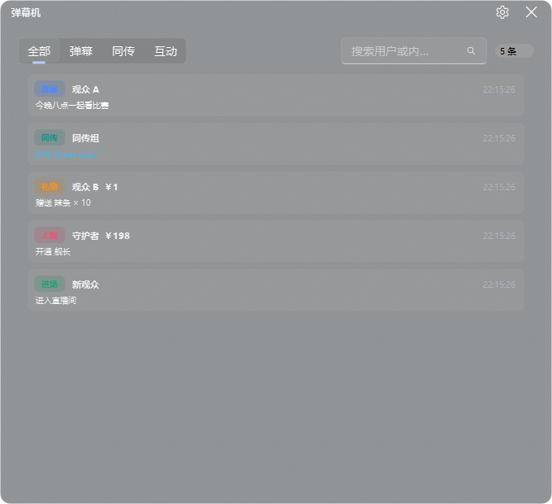

<div align="center">

# DD Monitor

**为 B 站多直播间观看、巡检与录制设计的桌面监控台**

基于 PySide6、Fluent Widgets 与 libmpv，提供可停靠工作区、16 个播放位、实时弹幕、主播卡片和直播录制。

[](app/core/app_version.py)
[](https://www.python.org/)
[](https://doc.qt.io/qtforpython-6/)
[](#安装与运行)
[](LICENSE)

[下载安装](#安装与运行) · [功能一览](#功能一览) · [使用指南](#使用指南) · [开发路线](docs/development-roadmap.md) · [问题反馈](https://github.com/BaoZiFly-233/DD_Monitor/issues)

</div>


## 项目定位

DD Monitor 把多个直播间放进一个可编排的桌面工作区。播放台始终位于中心，控制台和主播卡片以 Dock 面板存在，可以停靠、拖动、浮动或关闭；布局会在退出时保存，下次启动继续使用。

它适合以下场景：

- 同时关注多位主播的开播和直播状态；
- 在一个窗口内比较多路直播画面与音量；
- 运营直播观察台、VUP 观测站或内容巡检台；
- 等待主播开播后自动开始录制；
- 使用独立弹幕机查看消息，同时把滚动弹幕叠加到视频画面。

> 本项目最初由 [神君Channel](https://space.bilibili.com/637783) 开发，当前分支由 [BaoZi_Fly](https://space.bilibili.com/34094740) 维护。它不是哔哩哔哩官方客户端。

## 功能一览

| 能力 | 当前实现 |
| --- | --- |
| 多窗口播放 | 最多 16 个逻辑播放位；网格数量和布局可调整，单个播放位可切换为独立悬浮窗 |
| 播放内核 | libmpv Render API 嵌入 `QOpenGLWidget`，Qt 负责控制层与弹幕叠加 |
| 画质与线路 | 原画、蓝光、超清、流畅、仅音频；支持 CDN 候选切换和失败后自适应降档 |
| 音频控制 | 单窗口音量、静音、左右声道和 `0.5x - 4.0x` 音量增益；支持全局控制 |
| 实时弹幕 | 滚动、顶部、底部三类轨道；结构化事件、搜索分类工作台、同传识别和有界历史 |
| 主播发现 | 热门分区、VTB 名册、账号关注列表、房间号输入和短号解析 |
| 主播卡片 | 直播状态、置顶、封面、录制状态与右键操作；卡片面板可独立停靠或浮动 |
| 直播录制 | 立即录制、等待开播录制、断流检测和录制状态反馈 |
| 账号能力 | B 站扫码登录、登录态校验、关注列表获取；不登录也可以添加房间观看 |
| 工作区 | 控制台和卡片面板可移动、浮动、关闭，并保存 Dock 布局 |
| 配置安全 | 延迟写盘、配置迁移和三份备份轮转，异常配置可回退 |

### 可停靠监控工作区

主窗口不是固定仪表盘。中心区域只负责播放，控制台与卡片面板保留 Qt Dock 的完整能力：

- 拖动标题栏改变停靠位置；
- 拖出主窗口成为独立浮动面板；
- 关闭后通过顶部导航重新打开；
- 退出时保存尺寸、位置和停靠状态。

### 播放与弹幕

每个播放位都可以独立选择画质、CDN、声道、音量增益和弹幕模式。视频由 libmpv 解码，弹幕由 Qt 覆盖层绘制，两者生命周期分离。项目不加载 mpv 自带的 OSC、console、stats 等脚本，避免无用脚本干扰多实例播放。

弹幕引擎包含：

- 滚动、顶部、底部独立轨道；
- 追赶碰撞检测和显示区域限制；
- 后台文字栅格化、同请求合并与有界 LRU 缓存；
- 房间与连接代次校验，自动丢弃迟到的旧连接事件；
- 空内容过滤、关键词过滤和同传识别；
- 全开、仅弹幕机、全关三种快捷状态。

### 弹幕工作台



每个播放位都拥有一份有界弹幕时间线。工作台使用 Fluent 圆角列表和单个绘制委托，不为每条消息创建控件，也不再持续追加富文本 HTML：

- 按全部、弹幕、同传和互动快速筛选；
- 按用户名、正文、勋章或礼物名实时搜索；
- 保留用户、颜色、位置、时间、礼物金额、上舰等级和勋章等结构化字段；
- 每个播放位最多保留 500 条，爆量消息不会无限增长内存；
- 手动向上浏览时暂停自动跟随，并显示“回到最新”；
- 工具窗口关闭后隐藏复用，详细设置只在首次点击设置按钮时创建。

### 主播卡片与录制


添加直播间面板支持直接输入房号，也可以从热门分区、VTB 名册和登录账号的关注列表中选择。已添加主播会进入卡片面板，卡片可执行：

- 添加到指定播放位；
- 置顶或取消置顶；
- 打开网页直播间；
- 直播中立即录制；
- 未开播时进入等待录制状态；
- 删除不再关注的卡片。

### 完整设置面板


设置窗口集中管理播放、弹幕、缓存、布局和通用选项。窗口关闭后会隐藏并复用，不会在每次打开时重建全部控件；未应用的配色预览会自动回滚。

## 安装与运行

### 下载发行版

当前正式发布目标为 **Windows x64**。

1. 打开 [GitHub Releases](https://github.com/BaoZiFly-233/DD_Monitor/releases)。
2. 下载最新的 `DDMonitor-<版本>-windows-x64.zip`。
3. 解压到普通可写目录，不要直接在压缩包中运行。
4. 启动目录中的 `DDMonitor.exe`。

配置、缓存和日志都写在程序目录中。放在 `Program Files` 等需要管理员权限的目录可能导致配置无法保存。

### 从源码运行

要求：

- Windows 10/11 x64；
- Python 3.11；
- 与 Python 架构一致的 `libmpv-2.dll`。

```powershell
# 1. 获取源码
git clone https://github.com/BaoZiFly-233/DD_Monitor.git
cd DD_Monitor

# 2. 创建虚拟环境
python -m venv .venv
.\.venv\Scripts\Activate.ps1

# 3. 安装依赖
python -m pip install --upgrade pip
pip install -r requirements.txt

# 4. 将 x64 的 libmpv-2.dll 放到项目根目录后启动
python .\DD监控室.py
```

`qfluentwidgets_pro` 和 `blivedm` 已随仓库提供，不需要单独从 PyPI 安装。`libmpv-2.dll` 不进入 Git 仓库，需要自行准备；发布工作流使用 [shinchiro/mpv-winbuild-cmake](https://github.com/shinchiro/mpv-winbuild-cmake) 的 x64 开发包。

### 首次配置

1. 点击顶部的添加命令，输入直播间号或从列表选择主播。
2. 在卡片上选择播放位，或直接使用播放位右键菜单设置房间。
3. 拖动控制台和卡片面板，整理成适合显示器的工作区。
4. 需要关注列表时，从账号菜单扫码登录 B 站。
5. 打开设置面板调整默认画质、弹幕范围、缓存和布局。

## 使用指南

### 播放位操作

- **单击画面**：显示或隐藏播放器控制层。
- **双击画面**：切换悬浮播放窗口。
- **右键画面**：选择画质、CDN、音量增益、声道和弹幕操作。
- **拖动播放位**：交换两个播放位的位置及其关联配置。
- **控制台命令**：统一播放、刷新、停止、静音和调整全局音量。

### 弹幕操作

每个播放位的弹幕按钮按以下顺序切换：

```text
画面弹幕 + 弹幕机  ->  仅弹幕机  ->  全部关闭
```

全局弹幕设置可以统一修改透明度、显示范围、字体大小、过滤词和进入/礼物信息显示方式。弹幕机是完整工具窗口，支持搜索、分段筛选和历史浏览；关闭后保留状态，再次打开不会重新构造。

### Dock 面板

- 从标题栏拖动面板即可改变停靠位置；
- 拖到主窗口外可转为独立浮动窗口；
- 点击标题栏关闭按钮只隐藏面板；
- 顶部“控制台”和“卡片”命令可以恢复隐藏面板；
- 如果布局异常，可在布局设置中恢复默认工作区。

### 录制

在主播卡片的右键菜单中启动录制：

- 主播正在直播时立即开始；
- 主播未开播时进入等待状态，检测到开播后自动开始；
- 再次选择录制命令可取消录制或等待任务；
- 录制文件保存到选择的目录，卡片显示当前状态和持续时间。

请确保目标磁盘有足够空间，并遵守平台规则及主播授权要求。

## 数据与隐私

运行时数据默认位于仓库或发行版的 `resources/`、`cache/` 和 `logs/` 目录：

| 路径 | 内容 |
| --- | --- |
| `resources/config.json` | 播放位、布局、弹幕、账号会话等配置 |
| `resources/config_备份*.json` | 配置轮转备份 |
| `cache/` | 封面、头像和网络缓存 |
| `logs/app.log` | 运行日志 |
| `logs/crash-*.log` | 原生崩溃时的线程栈信息 |

配置可能包含登录会话信息。提交 Issue 时不要直接上传 `resources/config.json`，也不要公开 Cookie、二维码登录结果或完整请求头。

## 常见问题

### 启动时提示找不到 libmpv

确认项目根目录或程序目录中存在 `libmpv-2.dll`，并且 DLL 架构与 Python/应用一致。Windows x64 Python 必须使用 x64 libmpv。

### 直播间无法播放

先在浏览器确认直播间正在直播，然后尝试：

1. 右键切换 CDN；
2. 从原画降到蓝光或超清；
3. 检查系统代理、防火墙和本地时间；
4. 查看 `logs/app.log` 中对应房间的取流错误。

取流结果带有请求编号、房间号和画质校验，切换房间后迟到的旧结果会被丢弃。

### 程序异常退出，退出码为 `-1073741819`

该退出码是 Windows 原生访问冲突。请保留以下文件并在 Issue 中描述崩溃前的操作：

```text
logs/app.log
logs/crash-*.log
```

不要只粘贴退出码。故障模块、最后一次播放操作和线程栈对定位 libmpv、OpenGL 或驱动问题很重要。

### `QPixmap::scaled: Pixmap is a null pixmap`

这表示远程头像或封面下载/解码失败后得到空图片。当前版本会在缩放前检查空值；如果仍能复现，请附上日志和触发该图片的直播间。

### 关闭设置或添加窗口后短暂卡顿

当前窗口采用隐藏复用，并避免在 GUI 线程等待网络线程。若仍出现明显卡顿，请在 Issue 中注明窗口类型、首次打开还是再次打开，以及大致持续时间。

## 架构概览

```text
DD监控室.py
    |
    v
app/ui                 MainWindow、VideoWidget、Dock、设置和卡片
    |
    +---- app/media    libmpv OpenGL、取流线程、弹幕 WebSocket
    |
    +---- app/danmaku  过滤、文字缓存、滚动/顶部/底部轨道
    |
    `---- app/core     配置、凭据、HTTP、日志和版本信息
```

关键边界：

- UI 只消费带房间和请求身份的结果，不信任迟到线程信号；
- 弹幕线程发送不可变事件，视频浮层和工作台共享同一个有界模型；
- 视频由 libmpv 解码，Qt 管理界面与弹幕覆盖；
- 网络线程不直接修改 Qt 控件；
- 配置写入经过延迟合并，并维护轮转备份；
- 工具窗口关闭时优先隐藏复用，应用退出时再集中清理线程。

详细的参考研究、弹幕演进方向、性能预算和阶段计划见 [开发路线图](docs/development-roadmap.md)。

## 项目结构

```text
app/
├── core/               配置、网络、日志、凭据与版本
├── danmaku/            弹幕过滤、布局、缓存与渲染
├── media/              libmpv、直播取流与弹幕接收
└── ui/                 主窗口、播放器、卡片、设置与登录
blivedm/                随仓库维护的 B 站弹幕协议实现
qfluentwidgets_pro/     随仓库维护的 Fluent 组件库
docs/                   截图、路线图和发布文档
scripts/                构建、截图和稳定性脚本
tests/                  逻辑、线程、UI 与回归测试
```

## 开发与验证

安装开发工具：

```powershell
pip install pytest ruff pyinstaller
```

提交前执行：

```powershell
python -m pytest -q
python -m ruff check app tests scripts DD监控室.py
python -m compileall -q app tests scripts DD监控室.py
python scripts/make_screenshots.py
git diff --check
```

`python scripts/make_screenshots.py` 会离线构造真实 Qt/OpenGL 窗口并更新主界面、设置、添加直播间和弹幕机截图，同时验证完整退出路径。脚本使用临时配置，不会覆盖用户数据。

Windows 打包：

```cmd
set MPV_DLL=D:\path\to\libmpv-2.dll
scripts\build_win.bat x64
```

产物输出到 `release/DDMonitor-<版本>-windows-x64.zip`。版本号统一维护在 [`app/core/app_version.py`](app/core/app_version.py)。

## 文档

- [开发路线图与参考研究](docs/development-roadmap.md)
- [多平台计划](docs/multi-platform-plan.md)
- [文档写作约定](docs/writing-docs.md)
- [发布说明](docs/release-notes/)

## 贡献

欢迎提交可复现的 Issue 和范围明确的 Pull Request。涉及播放、线程或窗口生命周期时，请至少说明：

- 操作系统、Python 和 libmpv 架构；
- 复现步骤及发生频率；
- 是否涉及多路播放、悬浮窗或快速切换；
- 相关 `app.log` 与脱敏后的崩溃日志；
- 已执行的测试命令。

不要提交运行时配置、Cookie、日志目录、缓存、DLL 或录制文件。

## 致谢

- [zhimingshenjun/DD_Monitor](https://github.com/zhimingshenjun/DD_Monitor)：原始项目与产品基础。
- [python-mpv](https://github.com/jaseg/python-mpv)：libmpv Python 绑定。
- [bilibili-api-python](https://github.com/Nemo2011/bilibili-api)：B 站 API 能力。
- [PySide6-Fluent-Widgets](https://github.com/zhiyiYo/PyQt-Fluent-Widgets)：Fluent UI 组件体系。
- [KikoPlay](https://github.com/KikoPlayProject/KikoPlay) 与 [PiliPlus](https://github.com/bggRGjQaUbCoE/PiliPlus)：弹幕与直播架构研究参考。

## 许可证

本项目使用 [GNU Lesser General Public License v2.1](LICENSE)。第三方组件分别遵循其自身许可证。
